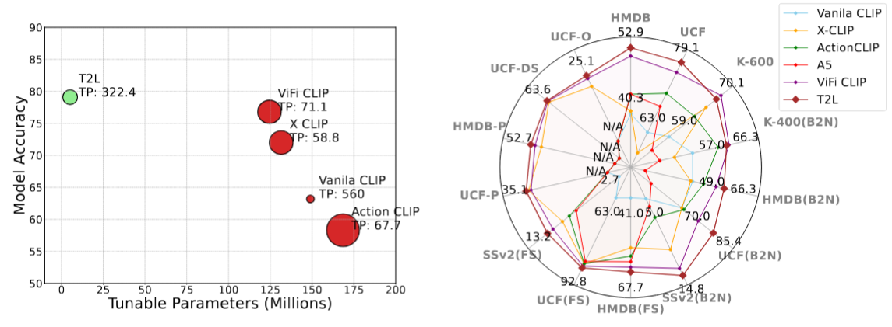
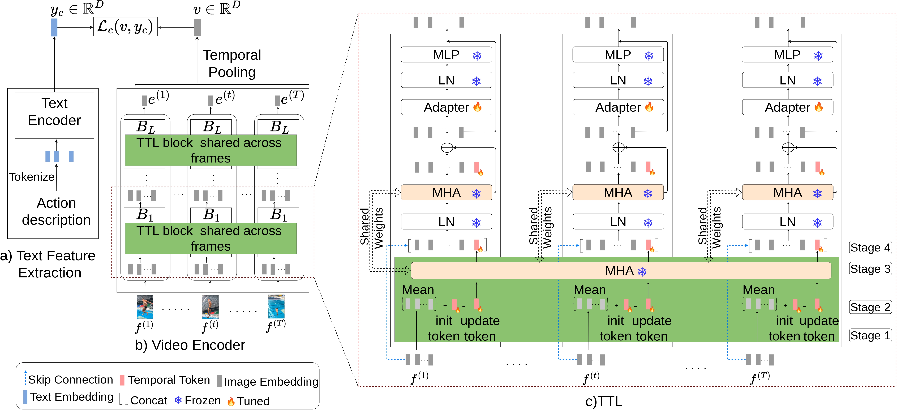

Here's an updated and professional `README.md` file tailored for your **T2L** project, reflecting its acceptance in **TMLR 2025**, and linking to the prior **EZ-CLIP** version. The teaser and main architecture figures are also included for clarity and impact.

---

```markdown
# T2L: Efficient Zero-Shot Action Recognition with Temporal Token Learning
[](https://openreview.net/forum?id=WvgoxpGpuU)

<p align="center">
  
</p>

> 📢 This is the official PyTorch implementation of our **TMLR 2025** accepted paper:  
> **T2L: Efficient Zero-Shot Action Recognition with Temporal Token Learning**  
> [[OpenReview]](https://openreview.net/forum?id=WvgoxpGpuU)

---

## 🔥 News
- **April 2025:** Our paper **T2L** has been accepted to **TMLR 2025**! 🎉  
- This repo supersedes our previous work **EZ-CLIP** [[EZ-CLIP GitHub]](https://github.com/Shahzadnit/EZ-CLIP.git), which was the earlier version on arXiv.

---

## 🌟 Highlights
- ⚡️ *Only 5.2M learnable parameters* with **25x fewer** tunables than prior works.
- 🧠 Introduces **Temporal Token Learning (TTL)** to model motion across video frames.
- 📈 Achieves *state-of-the-art performance* in zero-shot and base-to-novel generalization.
- 💡 Proposes **Temporal Feature Diversity Loss (TFD)** for learning temporal variations.
- 🧊 Keeps the core CLIP backbone frozen for maximum efficiency and generalization.

---

## 🧠 Introduction

<p align="center">
  
</p>

Temporal adaptation of vision-language models like CLIP is essential for video understanding, but existing approaches often suffer from high compute cost and overfitting. We propose **T2L**, a simple yet effective extension to CLIP that introduces:

- **Temporal Token Learning (TTL):** Injects temporal tokens into each transformer layer to capture cross-frame relations.
- **Temporal Feature Diversity (TFD) Loss:** Encourages variation in temporal embeddings to highlight motion cues.

Our method maintains **frozen CLIP weights** and only trains adapters and tokens—achieving strong performance in **zero-shot**, **few-shot**, and **base-to-novel generalization** benchmarks.

---

## 📄 Paper
**T2L: Efficient Zero-Shot Action Recognition with Temporal Token Learning**  
Shahzad Ahmad, Sukalpa Chanda, Yogesh S. Rawat  
Published in Transactions on Machine Learning Research (TMLR), April 2025  
[[OpenReview]](https://openreview.net/forum?id=WvgoxpGpuU)

---

## 📁 Contents
- [Requirements](#requirements)
- [Model Zoo](#model-zoo)
- [Data Preparation](#data-preparation)
- [Training](#training)
- [Testing](#testing)
- [Citation](#citation)
- [Acknowledgments](#acknowledgments)

---

## ⚙️ Requirements

Use the provided `requirements.txt` to set up the environment:

```bash
pip install -r requirements.txt
```

---

## 🧪 Model Zoo

All models use publicly available **ViT/B-16 CLIP** backbones.

| Model         | Input  | HMDB-51 | UCF-101 | Kinetics-600 | Model Link |
|---------------|--------|---------|---------|---------------|------------|
| T2L (ViT-16)  | 8x224  | 52.9    | 79.1    | 70.1          | [Download](https://drive.google.com/file/d/19QNGgaZjPyq0yz7XJGFccS7MV09KMY_K/view?usp=drive_link) |

---

## 📊 Base-to-Novel Generalization

| Dataset | Input  | Base | Novel | HM  | Model Link |
|---------|--------|------|-------|-----|------------|
| UCF-101 | 8x224  | 94.4 | 77.9  | 85.4 | [Download](https://drive.google.com/file/d/16HTxwbqfi1N8BPVjfrvL6F_A4xLNt-zc/view?usp=sharing) |

---

## 🧰 Data Preparation

Use `Dataset_creation_scripts/` to extract frames from videos for fast loading. Supported datasets include:
- [Kinetics](https://deepmind.com/research/open-source/open-source-datasets/kinetics/)
- [UCF-101](http://crcv.ucf.edu/data/UCF101.php)
- [HMDB-51](http://serre-lab.clps.brown.edu/resource/hmdb-a-large-human-motion-database/)

---

## 🚀 Training

```bash
python train.py --config configs/K-400/k400_train.yaml
```

---

## 🧪 Testing

```bash
python test.py --config configs/ucf101/UCF_zero_shot_testing.yaml
```

---

## 📌 Citation

If you find our code or models useful, please cite:

```bibtex
@article{ahmad2025t2l,
  title={T2L: Efficient Zero-Shot Action Recognition with Temporal Token Learning},
  author={Ahmad, Shahzad and Chanda, Sukalpa and Rawat, Yogesh S},
  journal={Transactions on Machine Learning Research (TMLR)},
  year={2025},
  url={https://openreview.net/forum?id=WvgoxpGpuU}
}
```

---

## 🤝 Acknowledgments

Our implementation builds on [ActionCLIP](https://github.com/sallymmx/ActionCLIP?tab=readme-ov-file).  
**T2L** is an enhanced and improved version of our earlier project [EZ-CLIP](https://github.com/Shahzadnit/EZ-CLIP.git) originally shared on arXiv.

---

📬 For any queries, reach out via [shahzaa@hiof.no](mailto:shahzaa@hiof.no)

```

---

