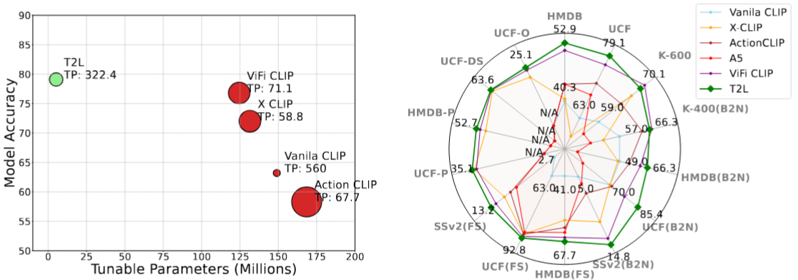

# T2L: Efficient Zero-Shot Action Recognition with Temporal Token Learning

  

> 📢 This is the official PyTorch implementation of our **TMLR 2025** accepted paper:  
> **T2L: Efficient Zero-Shot Action Recognition with Temporal Token Learning**  
> [[OpenReview]](https://openreview.net/forum?id=WvgoxpGpuU)

---

## 🔥 News
- **April 2025:** Our paper **T2L** has been accepted to **TMLR 2025**! 🎉 
- This repo supersedes our previous work **EZ-CLIP** [[EZ-CLIP GitHub]](https://github.com/Shahzadnit/EZ-CLIP.git), which was the earlier version on arXiv.

---

## 🌟 Highlights
- ⚡️ *Only 5.2M learnable parameters* with **25x fewer** tunables than prior works.
- 🧠 Introduces **Temporal Token Learning (TTL)** to model motion across video frames.
- 📈 Achieves *state-of-the-art performance* in zero-shot and base-to-novel generalization.
- 💡 Proposes **Temporal Feature Diversity Loss (TFD)** for learning temporal variations.
- 🧊 Keeps the core CLIP backbone frozen for maximum efficiency and generalization.

---

## 🧠 Introduction

  

Temporal adaptation of vision-language models like CLIP is essential for video understanding, but existing approaches often suffer from high compute cost and overfitting. We propose **T2L**, a simple yet effective extension to CLIP that introduces:

- **Temporal Token Learning (TTL):** Injects temporal tokens into each transformer layer to capture cross-frame relations.
- **Temporal Feature Diversity (TFD) Loss:** Encourages variation in temporal embeddings to highlight motion cues.

Our method maintains **frozen CLIP weights** and only trains adapters and tokens—achieving strong performance in **zero-shot**, **few-shot**, and **base-to-novel generalization** benchmarks.

---

## 📄 Paper
**T2L: Efficient Zero-Shot Action Recognition with Temporal Token Learning**  
Shahzad Ahmad, Sukalpa Chanda, Yogesh S. Rawat  
Published in Transactions on Machine Learning Research (TMLR), April 2025  
[[OpenReview]](https://openreview.net/forum?id=WvgoxpGpuU)

---

## 📁 Contents
- [Requirements](#requirements)
- [Model Zoo](#model-zoo)
- [Data Preparation](#data-preparation)
- [Training](#training)
- [Testing](#testing)
- [Citation](#citation)
- [Acknowledgments](#acknowledgments)

---

## ⚙️ Requirements

We provide the conda requirements.txt to help you install these libraries. You can initialize environment by using `pip install -r requirements.txt`.

